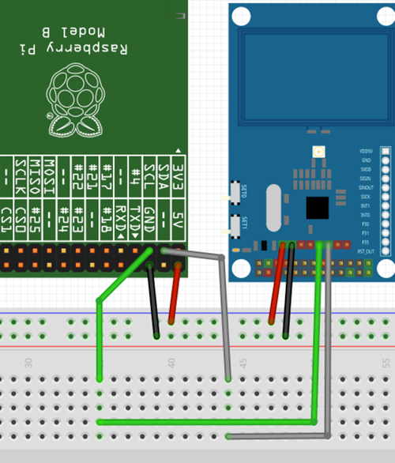

# Jetson I2C
## 1. 安装smbus库与配置——I2C
```
sudo apt-get install -y python3-smbus
sudo usermod -aG i2c <用户名>	    #添加用户组
sudo reboot 
sudo apt-get install -y i2c-tools
```

## 2. 链接NFC卡
身边只有itead公司生产的PN532 NFC卡，由于版本型号较老，这张卡只提供了26针的SPI接口，故使用I2C代替。
### 2.1 设置跳线
PN532卡上有两个跳线开关，设置成I2C模式
```
SET0-->H
SET1-->L
```
### 2.2 按照1的命令安装i2c并设置usermod
### 2.3 安装必要的应用包
```
sudo apt-get update
sudo apt-get install libusb-dev libpcsclite-dev

cd ~/Download
wget https://github.com/nfc-tools/libnfc/releases/download/libnfc-1.8.0/libnfc-1.8.0.tar.bz2
tar -xf libnfc-1.8.0.tar.bz2
cd libnfc-1.8.0 
./configure --prefix=/usr --sysconfdir=/etc
make &&sudo make install

# ubuntu系统需要拷贝权限文件
sudo cp contrib/udev/93-pn53x.rules /lib/udev/rules.d/
```
### 2.4 配置nfc
```
sudo mkdir /etc/nfc
sudo vim /etc/nfc/libnfc.conf

# Allow device auto-detection (default: true)
# Note: if this auto-detection is disabled, user has to manually set a device
# configuration using file or environment variable
allow_autoscan = true

# Allow intrusive auto-detection (default: false)
# Warning: intrusive auto-detection can seriously disturb other devices
# This option is not recommended, so user should prefer to add manually his/her device.
allow_intrusive_scan = false

# Set log level (default: error)
# Valid log levels are (in order of verbosity): 0 (none), 1 (error), 2 (info), 3 (debug)
# Note: if you compiled with --enable-debug option, the default log level is "debug"
log_level = 1

# Manually set default device (no default)
# To set a default device, users must set both name and connstring for their device
# Note: if autoscan is enabled, default device will be the first device available in device list.
device.name = "Itead_PN532"
device.connstring = "pn532_i2c:/dev/i2c-1"
```

### 2.5 硬件连接
如图所示  


注意：Orin系列对应的3，5针脚对应的是I2C8，目前没法读取数据，需要连接27，28针脚。具体可以参考:
```
sudo /opt/nvidia/jetson-io/jetson-io.py
```
### 2.6 读写NFC
至此，配置已经完成
使用命令进行测试：
```
sudo i2cdetect -y -r -a 1
     0  1  2  3  4  5  6  7  8  9  a  b  c  d  e  f
00: -- -- -- -- -- -- -- -- -- -- -- -- -- -- -- --
10: -- -- -- -- -- -- -- -- -- -- -- -- -- -- -- --
20: -- -- -- -- 24 -- -- -- -- -- -- -- -- -- -- --
30: -- -- -- -- -- -- -- -- -- -- -- -- -- -- -- --
40: UU -- -- -- -- -- -- -- -- -- -- -- -- -- -- --
50: -- -- -- -- -- -- -- -- -- -- -- -- -- -- -- --
60: -- -- -- -- -- -- -- -- -- -- -- -- -- -- -- --
70: -- -- -- -- -- -- -- -- -- -- -- -- -- -- -- --
# 没有全部--说明连接成功

nfc-list
# 如果nfc上有卡，则会读取卡中信息
```
如果门禁卡的 SAK 是 08，是可以被mfoc破解复制的，如果为 20 的话，需要使用mfuck
```
# 官网下载mfoc
git clone https://github.com/nfc-tools/mfoc
cd mfoc 
autoreconf -is
./configure
make && sudo make install
```
破解卡片信息
```
sudo mfoc -O bak.mfd
```
如果最后运行没有报错，那么 mfoc 就已经成功备份出门禁的数据 bak.mfd 了  

如果mfoc不能直接破解，则需要使用mfuck+mfoc进行破解
mfcuk (MiFare Classic Universal toolKit) 是一款基于 dackside 攻击原理破解全加密 M1 卡的开源软件，mfcuk 通过算法的漏洞破解出第一个 key，如果某个扇区的 key 被破解出来，就可以再使用 mfoc 工具使用 nested authentication 攻击破解其他扇区的密码。
```
# 安装mfuck
git clone https://github.com/nfc-tools/mfcuk
cd mfuck
autoreconf -is
./configure
make

# 进行破解
sudo ./mfcuk -C -R 0:A -s 250 -S 250 -v 3
# 破解过程很久，直到出现
INFO: block 4 recovered KEY: 3c5d7f1e.
```
得到第一个 key 之后，我就可以跟退出 mfcuk ，通过获取到的 key，使用 mfoc 进行再次解密
```
sudo mfoc -k 3c5d7f1e -O bak.mfd
```
如果 mfcuk 破解的第一个 key 是正确的，mfoc 命令一般会在几分钟之内完成整个 M1 卡所有扇区的破解，最终将成功生成导出备份文件。

写入新卡,使用 libnfc 软件包自带的 `nfc-mfclassic` 命令进行写卡，可以通过`nfc-mfclassic -h`获得帮助
```
nfc-mfclassic w a u bak.mfd
```

### 最后
可以看到使用的工具都是利用了m1卡的漏洞进行破解，所以一张门禁卡能不能复制就要看这个门禁卡有没有漏洞，如果是最近一两年才新加装的门禁系统，估计已经没有这些漏洞可以利用了。
