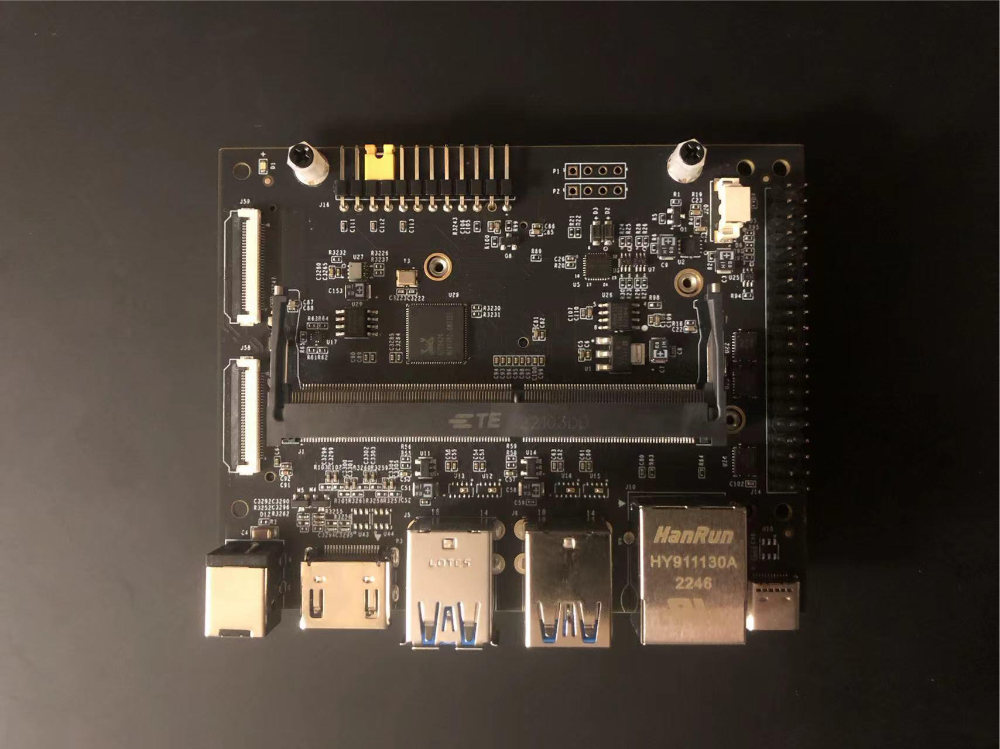

# NX 刷机教程
## 刷入Jetson Linux（L4T）
### 1. 命令行刷入（仅适合于符合官方载板设计的自研载板）
从官网查找[JetPack](https://developer.nvidia.com/embedded/jetpack-archive)最新版，这里使用JetPack5.1.1（L4T 35.3.1）举例。此版本支持新发的Orin NX系列和Orin Nano Developer Kit 但需要注意的是：Orin NX系列默认使用Orin Nano Developer Kit载板，但不影响Orin Nx使用。 
### 1.1 初始准备环境变量说明
1. 刷机必须使用一台Ubuntu 20.04 LTS或者Ubunt 18.04 LTS的PC或虚拟机。  
2. 环境变量说明： 
    * `${L4T_RELEASE_PACKAGE}` 包含Jetson Linux release 包，例如: `Jetson_Linux_<version>_aarch64.tbz2`.
    * `${SAMPLE_FS_PACKAGE}` 包含文件系统包，例如: `Tegra_Linux_Sample-Root-Filesystem_<version>_aarch64.tbz2`.
    * `${WORK_SPACE}`：工作根路径

### 1.2 刷机
1. 从官网[下载](https://developer.nvidia.com/linux-tegra)最新的Jetson Linux（L4T），分别下载以下两个文件到`${WORK_SPACE}`
    * `Jetson_Linux_<version>_aarch64.tbz2`
    * `Tegra_Linux_Sample-Root-Filesystem_<version>_aarch64.tbz2`
2. 解压文件并准备`rootfs`
    ```
    $ cd ${WORK_SPACE}
    $ tar xf ${L4T_RELEASE_PACKAGE}
    $ sudo tar xpf ${SAMPLE_FS_PACKAGE} -C Linux_for_Tegra/rootfs/
    $ cd Linux_for_Tegra/
    $ sudo ./apply_binaries.sh
    $ sudo ./tools/l4t_flash_prerequisites.sh
    ```
3. 修改修改 `Linux_for_Tegra/bootloader/t186ref/BCT/tegra234-mb2-bct-misc-p3767-0000.dts` 文件中的 内容为如下值：
    ```
    cvb_eeprom_read_size = <0x0>
    ```
4. 硬件安装完成后先不要急着上电，在符合官方标准的载板上用跳帽短接9和10针脚（FC REC和GND），如图下图 ，使其进入恢复模式（Force Recovery Mode）  
   
然后上电，此时会进入恢复模式。
5. 把USB线一头插入载板Type-C接口（其他USB口不支持恢复模式下连接），一头插上电脑（如果使用的是虚拟机，让usb接入虚拟机）。现在确认一下usb是否识别成功，输入：`lsusb`，如果出现：
    ```
    Bus <bbb> Device <ddd>: ID 0955: <nnnn> Nvidia Corp 

    其中
    = <bbb> is any three-digit number
    = <ddd> is any three-digit number
        <nnnn> 代表 Jetson module:
            7023 for Jetson AGX Orin (P3701-0000 with 32GB)
            7023 for Jetson AGX Orin (P3701-0005 with 64GB)
            7223 for Jetson AGX Orin (P3701-0004 with 32GB)
            7323 for Jetson Orin NX (P3767-0000 with 16GB)
            7423 for Jetson Orin NX (P3767-0001 with 8GB)
            7523 for Jetson Orin Nano (P3767-0003 and P3767-0005 with 8GB)
            7623 for Jetson Orin Nano (P3767-0004 with 4GB)
            7019 for Jetson AGX Xavier (P2888-0001 with 16GB)
            7019 for Jetson AGX Xavier (P2888-0004 with 32GB)
            7019 for Jetson AGX Xavier (P2888-0005 with 64GB)
            7019 for Jetson AGX Xavier Industrial (P2888-0008)
            7e19 for Jetson Xavier NX (P3668)
    ```
6. 此时可以去掉9和10针脚的跳帽。
7. 输入以下命令开始刷机：  
    刷入NVMe中
    ```
    sudo ./tools/kernel_flash/l4t_initrd_flash.sh --external-device nvme0n1p1 \
    -c tools/kernel_flash/flash_l4t_external.xml -p "-c bootloader/t186ref/cfg/flash_t234_qspi.xml" \
    --showlogs --erase-all --network usb0 jetson-orin-nano-devkit internal
    ```
    命令执行后，会有很多软件需要安装，根据提示安装完再重复执行，直到日志开始不停滚动，刷机开始为止。
8. 完成后Jetson会自动重启，重启后进行一些用户名密码的设置，刷机就成功了。
## 2. 安装Jetpack
### 2.1 换源
更换apt源
```
# 备份源文件
sudo cp /etc/apt/sources.list /etc/apt/sources.list.bak

# 使用国内源替换
sudo vim /etc/apt/sources.list

# 默认注释了源码镜像以提高 apt update 速度，如有需要可自行取消注释
deb https://mirrors.tuna.tsinghua.edu.cn/ubuntu-ports/ focal main restricted universe multiverse
# deb-src https://mirrors.tuna.tsinghua.edu.cn/ubuntu-ports/ focal main restricted universe multiverse
deb https://mirrors.tuna.tsinghua.edu.cn/ubuntu-ports/ focal-updates main restricted universe multiverse
# deb-src https://mirrors.tuna.tsinghua.edu.cn/ubuntu-ports/ focal-updates main restricted universe multiverse
deb https://mirrors.tuna.tsinghua.edu.cn/ubuntu-ports/ focal-backports main restricted universe multiverse
# deb-src https://mirrors.tuna.tsinghua.edu.cn/ubuntu-ports/ focal-backports main restricted universe multiverse

# deb https://mirrors.tuna.tsinghua.edu.cn/ubuntu-ports/ focal-security main restricted universe multiverse
# # deb-src https://mirrors.tuna.tsinghua.edu.cn/ubuntu-ports/ focal-security main restricted universe multiverse

deb http://ports.ubuntu.com/ubuntu-ports/ focal-security main restricted universe multiverse
# deb-src http://ports.ubuntu.com/ubuntu-ports/ focal-security main restricted universe multiverse

# 预发布软件源，不建议启用
# deb https://mirrors.tuna.tsinghua.edu.cn/ubuntu-ports/ focal-proposed main restricted universe multiverse
# # deb-src https://mirrors.tuna.tsinghua.edu.cn/ubuntu-ports/ focal-proposed main restricted universe multiverse

$ sudo apt update
```
### 2.1 SDK Manager安装
在安装机上下载SDK Manager，图形化界面，选择相应的套件，根据提示下一步即可。  
**[注意]** 选择安装软件时需要跳过Jetson Linux
### 2.2 命令行安装
在Jetson上输入：
```
sudo apt install nvidia-jetpack
```
时间会持续较长，取决于网络，等待安装完成。

### 2.3 升级
```
#升级cuda，目前还有些问题
wget https://developer.download.nvidia.com/compute/cuda/repos/ubuntu2004/arm64/cuda-keyring_1.0-1_all.deb
sudo dpkg -i cuda-keyring_1.0-1_all.deb
sudo apt-get update
sudo apt-get install cuda=11.8.0-1

```
如果出现安装错误，例如：
```
Unpacking cuda-nvml-dev-11-8 (11.8.86-1) ...
dpkg: error processing archive /tmp/apt-dpkg-install-iGJdtT/18-cuda-nvml-dev-11-8_11.8.86-1_arm64.deb (--unpack):
 trying to overwrite '/usr/local/cuda-11.8/include', which is also in package cuda-cccl-11-8 11.8.89-1
```
需要手动强制安装
```
wget https://developer.download.nvidia.com/compute/cuda/11.8.0/local_installers/cuda-tegra-repo-ubuntu2004-11-8-local_11.8.0-1_arm64.deb
sudo dpkg -i cuda-tegra-repo-ubuntu2004-11-8-local_11.8.0-1_arm64.deb
sudo dpkg -i --force-overwrite cuda-nvml-dev-11-8_11.8.86-1_arm64.deb
```

### 2.3 验证安装
```
# CUDA
nvcc -V

# openCV
pkg-config opencv4
```

## 目前遇到的一些问题
* 载板上的HDMI接口接上显示器后，无法设置4K分辨率。
* 性能测试不及使用官方的AGX载板，测试方法见下篇
